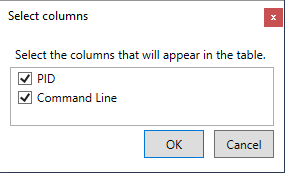
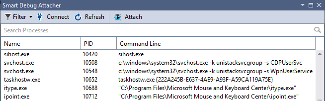
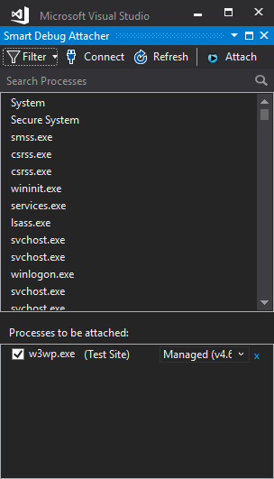
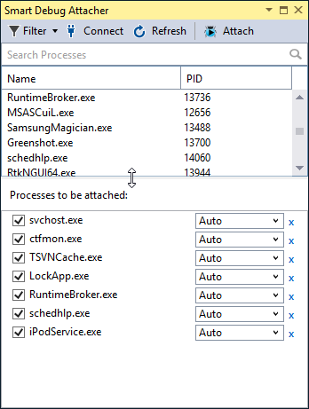
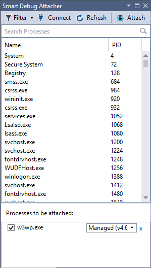
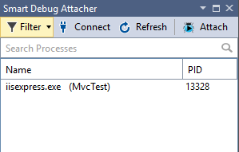
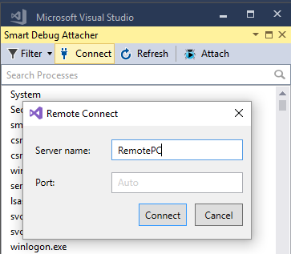

# Debug Attach Manager

Download the extension at the  [VS Gallery](https://marketplace.visualstudio.com/items?itemName=ViktarKarpach.DebugAttachManager2022) or get the [nightly build](http://vsixgallery.com/extension/facf6f74-1cc6-44be-b57d-115d48b30021/).

This extension gives you the ability to search for processes and then attach to them. It automatically saves selected processes between Visual Studio restarts. You can easily find IIS application pool specific processes and attach to them. The extension has the attach shortcut key, by default, it is Ctrl+Shift+Alt+F5. You can attach to multiple processes at once. If you are a web developer, then you must have it.

You can search processes by name, process id or command line. The command line column is initially hidden, you can enable it by right clicking on the process grid header:

The extension has non-standard themes support (e.g., Dark Theme):

Since you can attach to multiple processes at once, you might need extra space at the bottom, just drag splitter up:

 The extension supports Visual Studio Development (Cassini) server and IISExpress. For the Visual Studio Development server, it shows a port number in parenthesis. For the IISExpress it shows site name in parenthesis.

 

 

 The extension uses WMI to get IIS details information. You can use WBEMTest.exe to verify that you have appropriate permissions. 
 
 Here are a few tips for WMI access:
 * Try to run Visual Studio in Administrator mode.
 * Try to disable UAC
 * If disabling UAC helps then you can try to add the following to your registry:
 
 HKEY_LOCAL_MACHINE\SOFTWARE\Microsoft\Windows\CurrentVersion\Policies\System
 DWORD(32 bit): LocalAccountTokenFilterPolicy = 1

The extension adds two buttons to the standard toolbar panel:
* First button "Smart Start" starts an application without debugging. For web applications that use IISExpress the button doesn't open a new page as oppose to built-in Visual Studio "Start Without Debugging" command.
* The second button, "Attach Smart Debug Selections," attaches selected processes.

The extension also supports basic remote debugging:

The logged-in user needs to have access to the remote PC. Optionally you can specify user name and password. 

